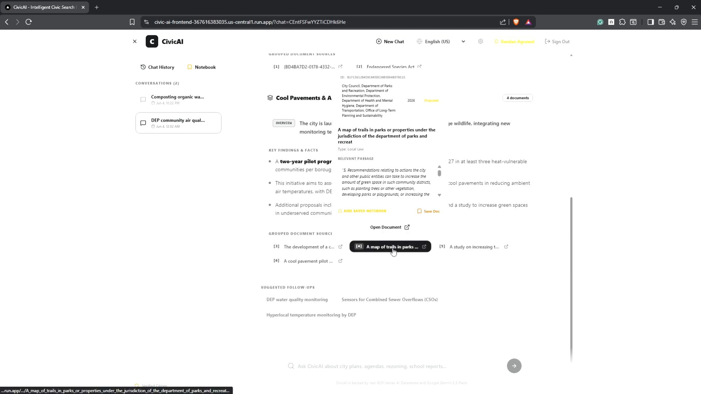

# CivicAI - AI-Powered Municipal Research and Analysis Engine

## 1. Description

CivicAI is an AI-powered municipal research and analysis platform designed for District Aides, policy researchers, and public interest advocates to efficiently navigate, analyze, and synthesize massive volumes of local government documents, legislation files, and public records. 

By leveraging a robust Retrieval-Augmented Generation (RAG) architecture, CivicAI answers complex municipal policy questions with high-context, verified insights backed by direct citations and live-rehydrated source document downloads. Additionally, the platform provides authenticated users with a secure, real-time persistent workspace (District Aide Research Notebook) to manage annotated bookmarks, research logs, and past search histories safely.

---

## 2. Feature Set & System Architecture

CivicAI operates on a dual-layer design, offering high-productivity user interfaces combined with enterprise-grade backend infrastructure.

### A. Visible / Frontend Features
* **Intelligent Multilingual AI Search (RAG)**: Connects to local government databases to answer policy, legislation, and public record questions with verified, localized answers across multiple languages (English, Spanish, Chinese, Bengali).
* **Live Rehydrated Source Document Downloads**: High-integrity document retrieval. Users can click and download original municipal PDF source files directly on-demand.
* **Dynamic Citations and Metadata Previews**: Citations are embedded dynamically inline with AI responses. Hovering over a citation reveals deep document metadata and previews in result cards.
* **District Aide Research Notebook**: A persistent, real-time authenticated space for saving annotated bookmarks, custom research notes, and legislative records.
* **Persistent Conversation History Logging**: A real-time research history feed allowing District Aides to seamlessly jump back into prior research sessions.
* **Unified Sidebar Control**: A high-efficiency navigation sidebar that collapses and organizes bookmarked notebooks and chat history tabs with responsive tab controls.
* **Glassmorphic Dark-Themed Dashboard**: Built on modern UI principles featuring a sleek custom layout, premium visual backdrops, smooth micro-animations, and responsive independent panel scrolling.
* **Interactive Suggested Starters**: Prompts unauthenticated or returning users with randomized common policy suggestion templates to start research instantly.

### B. Invisible / "Under-the-Hood" Features
* **Automated Incremental Ingestion Pipeline (`ingest.py`)**: Daily automated cron job (configured via GCP Cloud Scheduler and Cloud Run Jobs) that automatically extracts, filters, and synchronizes 650+ municipal documents from the NYC Council API directly to Vertex AI Search Datastores.
* **Secure OAuth 2.0 Integration (NextAuth.js)**: Cryptographically secure Google OAuth 2.0 flow allowing users to log in securely to save bookmarks, persist notebook annotations, and manage personal search history.
* **Low-Latency Google Cloud Firestore Sync**: High-concurrency database synchronization using Native Firestore SDKs to persist notebook annotations and bookmark states in real-time across devices.
* **DDoS Mitigation & Ingress Traffic Protection**: Advanced network-level defenses against Distributed Denial of Service (DDoS) and brute-force scraping attempts, utilizing strict ingress traffic filtering, endpoint rate limiting, and GCP serverless load-balancer autoscaling.
* **Multi-Stage Containerized Builds**: Optimized multi-stage Dockerfiles compiling Next.js and FastAPI environments into production-ready lightweight serverless container images to minimize cold-start latency.

---

## 3. How to Run It on Your End

Follow these steps to set up, configure, and run the CivicAI search engine and database synchronization system locally.

### Step 1: Request NYC Council API Credentials
CivicAI leverages legislative data from the New York City Council. 
1. Submit an API subscription key application at https://council.nyc.gov/legislation/api/
2. Once approved, you will receive an API Subscription Key to fetch municipal legislative documents.

### Step 2: System Pre-requisites
Ensure you have the following installed on your local machine:
- Python 3.10 or higher
- Node.js 18 or higher (with npm)
- Git

### Step 3: Google Cloud Platform Setup
CivicAI requires a Google Cloud Project (GCP) to run its AI search and storage mechanisms:
1. Create a project in the Google Cloud Console.
2. Enable the **Vertex AI API**, **Vertex AI Search and Conversation API**, and **Cloud Firestore API**.
3. Create a **Vertex AI Search Datastore** and ingest municipal documents (or link it to a Google Cloud Storage bucket containing your files).
4. Configure Cloud Firestore in Native Mode (using the default database).
5. Set up Google OAuth Client Credentials in the GCP APIs & Services console (redirect URL: `http://localhost:3000/api/auth/callback/google` for local development).
6. Generate and download a GCP Service Account JSON key with Viewer/Editor permissions to Vertex AI and Firestore.

### Step 4: Clone the Repository
Clone the repository and navigate into the project root:
```bash
git clone https://github.com/1dan1609/CivicAI
cd CivicAI
```

### Step 5: Configure the Backend Environment
Create a `.env` file in the root directory of the project:
```env
PORT=8000
API_BASE_URL=http://localhost:8000
FRONTEND_URL=http://localhost:3000

# GCP Configuration
GOOGLE_APPLICATION_CREDENTIALS=path/to/your/gcp-service-account-key.json
PROJECT_ID=your-gcp-project-id
LOCATION=us-central1
DATASTORE_ID=your-vertex-ai-datastore-id
FIRESTORE_DATABASE_ID=(default)

# AI & Third-Party APIs
NYC_COUNCIL_API_KEY=your-nyc-council-api-key
GEMINI_API_KEY=your-google-gemini-api-key
```

### Step 6: Set Up and Run the FastAPI Backend
1. Install the required Python packages:
```bash
pip install -r requirements.txt
```
2. Start the FastAPI server locally:
```bash
uvicorn main:app --reload --port 8000
```
The backend server will run on `http://localhost:8000` with Swagger interactive documentation available at `http://localhost:8000/docs`.

### Step 7: Configure the Frontend Environment
Navigate to the `frontend` folder and create a `.env.local` file:
```bash
cd frontend
```
Add the following frontend environment variables to `frontend/.env.local`:
```env
NEXT_PUBLIC_API_BASE_URL=http://localhost:8000

# NextAuth Configuration (Google Authentication)
NEXTAUTH_URL=http://localhost:3000
NEXTAUTH_SECRET=a-secure-random-32-character-string

# Google OAuth Credentials
GOOGLE_CLIENT_ID=your-google-oauth-client-id.apps.googleusercontent.com
GOOGLE_CLIENT_SECRET=your-google-oauth-client-secret
```

### Step 8: Set Up and Run the Next.js Frontend
1. Install front-end dependencies:
```bash
npm install
```
2. Run the Next.js development server:
```bash
npm run dev
```
The frontend web application will start on `http://localhost:3000`.

---

## 4. Demo Video

[](https://drive.google.com/file/d/141efwC7CBAa8DUaunwbLdnHu2dcuvWo4/view?usp=sharing)

*Click the preview image above to watch the full product walkthrough on Google Drive.*

---

## 5. Techstack and Project Structure

### Techstack Rollout

- **Backend (Core Engine)**: Python 3.11, FastAPI, Uvicorn (Handles RAG logic, Rate Limiting, and Data Synchronization).
- **Frontend (UI/UX)**: Next.js 15 (TypeScript/React), Tailwind CSS, Lucide Icons, NextAuth.js (Google OAuth).
- **AI Infrastructure**: Google Vertex AI Search (RAG architecture), Google Gemini 2.5 (LLM summaries).
- **Database & Persistence**: Google Cloud Firestore (Real-time sync for Research Notebooks), Google Cloud Storage.
- **Data Ingestion**: Python (Automated daily incremental extraction from NYC Council API).
- **DevOps & Cloud**: Docker (Containerization), GCP Cloud Run (Serverless Deployment), Google Cloud Scheduler (Automation).

### Directory & File Responsibilities

```
CivicAI/
│
├── frontend/                                   # Next.js 15 Web Application Directory
│   ├── public/                                 # Static Assets & SVG Illustrations
│   │   ├── file.svg                            # Default document file layout icon.
│   │   ├── globe.svg                           # Global network/web resource icon.
│   │   ├── next.svg                            # Next.js framework official logo.
│   │   ├── vercel.svg                          # Vercel deployment hosting platform logo.
│   │   └── window.svg                          # Browser interface mock outline icon.
│   │
│   ├── src/                                    # Frontend Application Source Code
│   │   ├── app/                                # Next.js App Router & Routes
│   │   │   ├── api/auth/[...nextauth]/         # NextAuth.js Secure Authentication Routes
│   │   │   │   └── route.ts                    # Dynamic NextAuth.js API handler for Google OAuth.
│   │   │   ├── favicon.ico                     # Browser address-bar bookmark icon.
│   │   │   ├── globals.css                     # Main CSS file containing custom animations and design tokens.
│   │   │   ├── layout.tsx                      # Main Next.js root layout defining fonts and viewport wrappers.
│   │   │   └── page.tsx                        # Main Interactive Search Dashboard page containing search and UI logic.
│   │   │
│   │   ├── components/                         # Reusable React & UI Components
│   │   │   ├── ui/                             # Primitive Design-System Components (Shadcn UI)
│   │   │   │   ├── accordion.tsx               # Collapsible expandable information cards.
│   │   │   │   ├── badge.tsx                   # Sleek status labels and pill-style indicators.
│   │   │   │   ├── button.tsx                  # Modular action button with custom interactive hover animations.
│   │   │   │   ├── card.tsx                    # Glassmorphic display containers for data cards.
│   │   │   │   ├── checkbox.tsx                # Interactive input boxes for user choices and filters.
│   │   │   │   ├── hover-card.tsx              # Rich popover card triggered on cursor hover.
│   │   │   │   └── input.tsx                   # Customizable form input text fields.
│   │   │   │
│   │   │   ├── AnalyticsPanel.tsx              # Renders metrics, trend lines, and district statistics.
│   │   │   ├── BookmarksPanel.tsx              # User Research Notebook for managing bookmarked files and notes.
│   │   │   ├── ChatHistoryPanel.tsx            # Session logs panel showing previous research runs.
│   │   │   ├── ReasoningPanel.tsx              # Renders detailed multi-document synthesis and AI insights.
│   │   │   └── ResultCard.tsx                  # Modular search card showing matching files, metadata, and citation logs.
│   │   │
│   │   ├── context/                            # Application State Contexts
│   │   │   └── AuthContext.tsx                 # React Context API for managing user login and profile states.
│   │   │
│   │   └── lib/                                # Core Utility Functions
│   │       └── utils.ts                        # Tailwind CSS merging utilities and helper methods.
│   │
│   ├── Dockerfile                              # Next.js multi-stage Docker build pipeline instructions.
│   ├── components.json                         # Shadcn/ui CLI configuration manifest file.
│   ├── eslint.config.mjs                       # Linter and code-quality policy rules.
│   ├── next.config.ts                          # Next.js framework runtime configuration settings.
│   ├── package-lock.json                       # Lock file securing exact node package dependencies.
│   ├── package.json                            # Package manifest declaring app scripts and library versions.
│   ├── postcss.config.mjs                      # PostCSS compiler config for processing Tailwind CSS.
│   ├── tsconfig.json                           # TypeScript compiler parameters and alias mappings.
│   └── .gitignore                              # Frontend-specific build and workspace files exclusions.
│
├── main.py                                     # Python FastAPI Backend Engine implementing RAG logic, rate limits, and Firestore syncing.
├── ingest.py                                   # Python Automation Pipeline for downloading and indexing municipal legislative data.
├── Dockerfile                                  # Backend Python multi-stage containerized environment instructions.
├── requirements.txt                            # Main Python dependency package requirements file.
├── Thumbnail.png                               # Main high-fidelity product guide preview thumbnail image.
├── .gcloudignore                               # Exclusions file for optimizing Google Cloud CLI deployments.
├── .gitattributes                              # Git LFS tracking configuration definitions.
├── .gitignore                                  # Git exclusion definitions for protecting secrets and environment variables.
└── README.md                                   # Root-level comprehensive, high-fidelity user guide.
```


